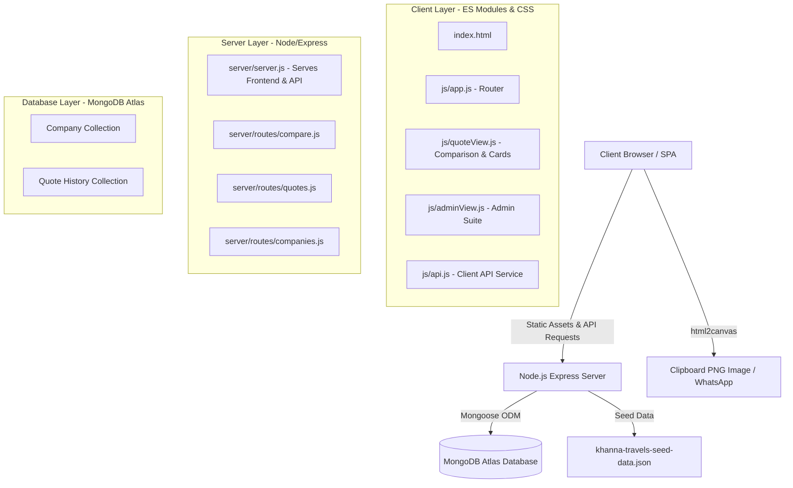

# Khanna Travels — Travel Insurance Quotation Engine
### Complete Technical & Architectural Documentation

---

## 1. Project Overview

The **Khanna Travels Travel Insurance Quotation Engine** is a specialized web application engineered for travel advisors and booking agents at Khanna Travels. It provides instant premium comparisons across multiple insurance providers (Bajaj Allianz, Asego, ICICI, Tata AIG, etc.) tailored to passenger age, travel duration, destination, and medical coverage criteria.

### Key Capabilities
- **Unified Standard Node Host Architecture**: Single process running Express that serves both the static frontend (`index.html`, `css/`, `js/`) and the REST API (`/api/*`). Ready for deployment on Render, Railway, or any Linux/Windows VPS.
- **Instant Multi-Insurer Rate Calculation**: Matches passenger age and trip duration against multi-tier actuarial rate slabs.
- **Unified Comparison Table**: Displays rates grouped by sum insured ($50,000 to $1,000,000) with automatic *Best Price* highlights.
- **Company Quick Selector**: One-click toggles to select all quotes or all plans of a specific insurer.
- **Fixed Non-Expanding Bottom Bar**: Compact 52px floating dock with company summary badges that never covers table content.
- **Company-Separated Quotation Cards**: Breaks selected quotes into distinct, company-branded cards.
- **Direct Clipboard Image Copying**: Generates clean PNG quotation cards via `html2canvas` and writes directly to the OS clipboard for instant `Ctrl + V` pasting into WhatsApp, Telegram, or email.
- **Comprehensive Admin Panel**: Full management suite to create, edit, or seed insurers, plans, and rate grids.

---

## 2. System Architecture



---

## 3. Directory & Folder Structure

```
quatation/
│
├── index.html                           # Single Page Application root document
├── .env / .env.example                  # Environment configuration templates
├── PROJECT_DOCUMENTATION.md             # Master project technical manual
├── README.md                            # Quick start & repository overview
│
├── css/                                 # Design System & Stylesheets
│   ├── main.css                         # Global CSS custom properties, typography, resets, header & badges
│   ├── quote.css                        # Quote forms, comparison tables, company filter bar & bottom dock
│   ├── quotation.css                    # Branded quotation cards, modal dialogs, and action buttons
│   ├── admin.css                        # Admin panel layout, company management cards, and modal dialogs
│   ├── print.css                        # Media print formatting for PDF and browser print flows
│   ├── tables.css                       # Reusable responsive table rules and cell alignments
│   ├── dashboard.css                    # Dashboard metrics, summary cards, and stats counters
│   └── khanna-travels-seed-data.json    # Master seed dataset (Asego, Bajaj, Bajaj Allianz)
│
├── js/                                  # Frontend Application Modules (ES Modules)
│   ├── app.js                           # App router, view switcher (Quote vs Admin), and toast manager
│   ├── quoteView.js                     # Core quote flow: trip form, comparison table, dock & cards
│   ├── adminView.js                     # Administrative panel: CRUD for companies, plans, and rate grids
│   ├── api.js                           # Centralized HTTP client communicating with backend REST endpoints
│   ├── data.js                          # Static fallback data, country lists, and region categorizers
│   ├── engine.js                        # Client-side rate calculation & matrix filter engine
│   ├── storage.js                       # LocalStorage cache, recent search history, and draft quotes
│   └── pdf-export.js                    # Helper module for document printing and PDF exports
│
└── server/                              # Backend Node.js / Express Server
    ├── server.js                        # Express server entry point, static asset serving, routes & error handling
    ├── db.js                            # MongoDB Atlas connection manager with Mongoose
    ├── package.json                     # Server dependencies (express, mongoose, dotenv, cors, multer)
    ├── package-lock.json                # Locked dependency tree
    ├── seed.js                          # CLI seeder utility (`node seed.js [--force]`)
    ├── khanna-travels-seed-data.json    # Server-side seed data copy
    ├── atlas-credentials.env            # Reference connection string configuration
    │
    ├── models/                          # Mongoose Database Models
    │   ├── Company.js                   # Nested Schema: Company -> Plan -> Rate
    │   └── Quote.js                     # Schema for saved quotes with KT-YYYYMMDD-#### references
    │
    ├── routes/                          # REST API Endpoints
    │   ├── compare.js                   # POST /api/compare (Calculates rates for age/duration/region)
    │   ├── quotes.js                    # GET & POST /api/quotes (Saves and retrieves agent quotes)
    │   ├── companies.js                 # CRUD /api/companies (Add, update, soft-delete companies)
    │   ├── plans.js                     # CRUD /api/plans (Plan management under companies)
    │   ├── rates.js                     # CRUD /api/rates (Individual rate slab management)
    │   └── auth.js                      # Admin session & authentication verification
    │
    └── middleware/                      # Express middleware (error handling, auth verification)
```

---

## 4. File-by-File Detailed Explanation

### Root Files
- **[index.html](file:///c:/Users/admin/Downloads/quatation1/quatation/index.html)**: Main HTML shell. Configures fonts (Google Fonts Inter), metadata, header with brand logo (*KHANNA TRAVELS - HOLIDAYS REDEFINED*), navigation buttons (*New Quote*, *Admin*), container `#app`, toast container, and loads external CDN library `html2canvas`.
- **[README.md](file:///c:/Users/admin/Downloads/quatation1/quatation/README.md)**: Quick start guide with local startup and deployment instructions.
- **[PROJECT_DOCUMENTATION.md](file:///c:/Users/admin/Downloads/quatation1/quatation/PROJECT_DOCUMENTATION.md)**: Master architecture manual.
- **[.env](file:///c:/Users/admin/Downloads/quatation1/quatation/.env)**: Contains server port and `MONGODB_URI` connection string.

### `css/` Directory
- **[css/main.css](file:///c:/Users/admin/Downloads/quatation1/quatation/css/main.css)**: Global CSS design tokens (primary colors, slate tones, accent amber, border radiuses, shadows), base typography, header styling, and toast notification styles.
- **[css/quote.css](file:///c:/Users/admin/Downloads/quatation1/quatation/css/quote.css)**: Styles for the quote input panel, date selectors, comparison tables, coverage tabs, company quick select bar (`.company-quick-select-bar`), and the slim 52px floating dock (`.quote-selection-dock`).
- **[css/quotation.css](file:///c:/Users/admin/Downloads/quatation1/quatation/css/quotation.css)**: Layout and aesthetics for the generated quotation preview modal, company-separated quotation cards (`.company-quote-card`), action button bars, and responsive print preview.
- **[css/admin.css](file:///c:/Users/admin/Downloads/quatation1/quatation/css/admin.css)**: Admin dashboard styling: company cards, plan tables, rate grids, badge pills, and modal dialogs for adding/editing rates.
- **[css/print.css](file:///c:/Users/admin/Downloads/quatation1/quatation/css/print.css)**: `@media print` rules ensuring clean A4-formatted page breaks and hiding unnecessary UI controls when printing.
- **[css/tables.css](file:///c:/Users/admin/Downloads/quatation1/quatation/css/tables.css)**: Generic responsive table classes, striped rows, and currency column alignments.
- **[css/dashboard.css](file:///c:/Users/admin/Downloads/quatation1/quatation/css/dashboard.css)**: Layout styling for KPI stat widgets and quote activity lists.
- **[css/khanna-travels-seed-data.json](file:///c:/Users/admin/Downloads/quatation1/quatation/css/khanna-travels-seed-data.json)**: The master seed database containing company, plan, and rate definitions.

### `js/` Directory
- **[js/app.js](file:///c:/Users/admin/Downloads/quatation1/quatation/js/app.js)**: Client entry point. Initializes navigation handlers, handles view routing (`quote` vs `admin`), and manages toast alerts.
- **[js/quoteView.js](file:///c:/Users/admin/Downloads/quatation1/quatation/js/quoteView.js)**: The heart of the quotation experience:
  - Form state handling (dates, age calculation, country destination, region auto-detect).
  - Fetches and displays comparison results grouped by coverage.
  - Multi-select checkbox engine for rate selection.
  - Renders the Quick Company Selector bar.
  - Manages the slim floating dock with company count badges.
  - Generates company-separated quotation cards.
  - Integrates `html2canvas` for single-company image copy, download, and plain-text WhatsApp formatting.
- **[js/adminView.js](file:///c:/Users/admin/Downloads/quatation1/quatation/js/adminView.js)**: Admin view controller enabling agents to add/modify insurance companies, create plans, and edit rate matrix tables directly.
- **[js/api.js](file:///c:/Users/admin/Downloads/quatation1/quatation/js/api.js)**: Wrapper around `fetch()` for backend API communication (`/api/compare`, `/api/companies`, `/api/quotes`, etc.).
- **[js/data.js](file:///c:/Users/admin/Downloads/quatation1/quatation/js/data.js)**: Static lookup data, country lists, and region classifiers (detects if a country is USA/Canada to toggle "Including" vs "Excluding").
- **[js/engine.js](file:///c:/Users/admin/Downloads/quatation1/quatation/js/engine.js)**: Client-side mathematical rate matching fallback engine.
- **[js/storage.js](file:///c:/Users/admin/Downloads/quatation1/quatation/js/storage.js)**: Manages `localStorage` for recent searches and offline caching.
- **[js/pdf-export.js](file:///c:/Users/admin/Downloads/quatation1/quatation/js/pdf-export.js)**: Triggers print stylesheets and PDF generation.

### `server/` Directory
- **[server/package.json](file:///c:/Users/admin/Downloads/quatation1/quatation/server/package.json)**: The single source of truth for all project dependencies (`express`, `mongoose`, `dotenv`, `cors`, `multer`) and scripts (`start`, `dev`, `seed`).
- **[server/server.js](file:///c:/Users/admin/Downloads/quatation1/quatation/server/server.js)**: Configures Express:
  - Serves static assets from root (`path.join(__dirname, '..')`).
  - Mounts REST API routes under `/api/*`.
  - Catches unmatched `/api/*` requests with a clean JSON 404.
  - Catches all non-API GET requests with `index.html` for client-side routing.
  - Listens dynamically on `process.env.PORT || 3000` with graceful `EADDRINUSE` handling.
- **[server/db.js](file:///c:/Users/admin/Downloads/quatation1/quatation/server/db.js)**: Encapsulates one-time Mongoose database connection logic at boot.
- **[server/seed.js](file:///c:/Users/admin/Downloads/quatation1/quatation/server/seed.js)**: Seeder script to populate MongoDB from `khanna-travels-seed-data.json`. Supports `--force` to refresh existing data.
- **[server/models/Company.js](file:///c:/Users/admin/Downloads/quatation1/quatation/server/models/Company.js)**: Hierarchical Mongoose schemas:
  - `RateSchema`: Coverage, Region, Age bounds, Day bounds, Premium, Currency.
  - `PlanSchema`: Plan name, Product line, Medical cover flag, Policy type, Rates array.
  - `CompanySchema`: Company name, Active status, Plans array.
- **[server/models/Quote.js](file:///c:/Users/admin/Downloads/quatation1/quatation/server/models/Quote.js)**: Model for historical quotes generated with sequential references (`KT-YYYYMMDD-####`).
- **[server/routes/compare.js](file:///c:/Users/admin/Downloads/quatation1/quatation/server/routes/compare.js)**: Calculates matching rates across all active plans in MongoDB based on passenger age, duration, and region.
- **[server/routes/quotes.js](file:///c:/Users/admin/Downloads/quatation1/quatation/server/routes/quotes.js)**: Handles creating, searching, and fetching quote records.
- **[server/routes/companies.js](file:///c:/Users/admin/Downloads/quatation1/quatation/server/routes/companies.js)**: CRUD endpoints for insurer profiles.
- **[server/routes/plans.js](file:///c:/Users/admin/Downloads/quatation1/quatation/server/routes/plans.js)**: CRUD endpoints for plans.
- **[server/routes/rates.js](file:///c:/Users/admin/Downloads/quatation1/quatation/server/routes/rates.js)**: Endpoints to update individual rate slabs.

---

## 5. Database Schema & Data Models

### Hierarchical Model Diagram
```
Company (e.g., "Bajaj Allianz")
 └── Plans [] (e.g., "Travel Prime Super Age - With Medical")
      ├── productLine: "Super age 70+"
      ├── medicalCover: true
      ├── policyType: "new"
      └── Rates []
           ├── coverage: 50000
           ├── region: "Excluding"
           ├── ageFrom: 70, ageTo: 75
           ├── daysFrom: 8, daysTo: 14
           ├── premium: 2443
           └── currency: "INR"
```

---

## 6. Production Hosting & Deployment (Render / Railway / VPS)

Because the project runs as a standard Node.js server serving both the frontend and API, it deploys directly onto any container or Node host:

### Render.com Setup
- **Environment**: Node
- **Root Directory**: `.`
- **Build Command**: `cd server && npm install`
- **Start Command**: `node server/server.js` (or `cd server && npm start`)
- **Environment Variables**:
  - `MONGODB_URI`: `mongodb+srv://...`
  - `PORT`: (Auto-injected by Render)

### Railway Setup
- **Root Directory**: `.`
- **Build Command**: `cd server && npm install`
- **Start Command**: `node server/server.js`

### VPS / Linux / Windows Server
```bash
cd server
npm install
npm run seed -- --force   # (Optional: seeds fresh database)
npm start
```
